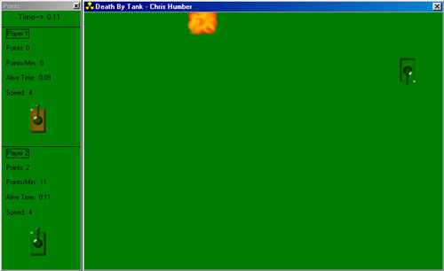

<div align="center">

## a \! Death By Tank \! a


</div>

### Description

SCREEN SHOT INSIDE!!! CHECK IT OUT...

I wrote this program to see if AI could be written

well in VB...as i found out, it can, i just used

a very simple binary tree. It's missing no bells

or whistles, it has sound, and very good Artificial

Intelligence. It Also has some internet support, however

it is not great. Im more than welcome to suggestions

if you are willing to give them!!! Plz Do, infact.
 
### More Info
 
This code is not documented, you will

just have to muddle thru it, if you wish

to understand what it is i am doing.

Also, people have been giving me feeback about

how BitBlt causes overflow errors. Anybody out

there that has used this API knows its problems.

The deadly overflow. That is why i recomend 32 mb's

ram, its not to stop it from happening, its to

stop it from looking choppy and refreshing very

badly. To remedy an overflow error, simply turn

your computer off, and then back on, and restart

the program. It should run without the overflow.

Plz contact me if you have further problems:

chrishsb@home.com


<span>             |<span>
---                |---
**Submitted On**   |2000-04-19 17:13:42
**By**             |[C\. Humber](https://github.com/Planet-Source-Code/PSCIndex/blob/master/ByAuthor/c-humber.md)
**Level**          |Intermediate
**User Rating**    |4.3 (47 globes from 11 users)
**Compatibility**  |VB 5\.0, VB 6\.0
**Category**       |[Games](https://github.com/Planet-Source-Code/PSCIndex/blob/master/ByCategory/games__1-38.md)
**World**          |[Visual Basic](https://github.com/Planet-Source-Code/PSCIndex/blob/master/ByWorld/visual-basic.md)
**Archive File**   |[CODE\_UPLOAD49714192000\.zip](https://github.com/Planet-Source-Code/c-humber-a-death-by-tank-a__1-7362/archive/master.zip)

### API Declarations

```
INSTRUCTIONS!!!!!
Single Player:
Wimp-->Easy level
Quick Death-->Medium level
Game Over-->Very Difficult
Keys:
Player 1:
Respective Arrow keys move tank that way.
CTRL Shoots
+/- increase and decrease speed.
 (+/- by the num pad)
Player 2:
t=Up
g=Down
f=Left
h=Right
Shift Shoots
` decreases speed
TAB increases speed
'
'
'
BitBlt (with this API, i recomend at least 32 mb's
ram)
sndPlaySound
```


